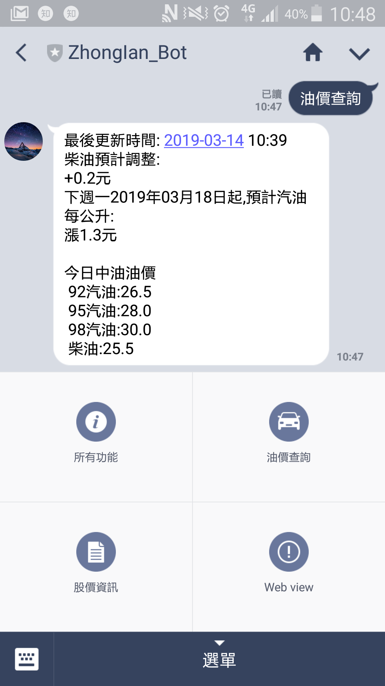
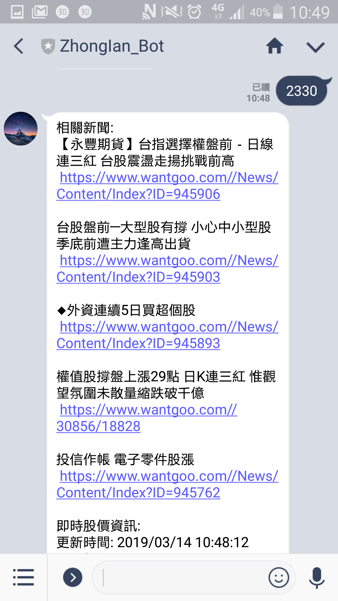
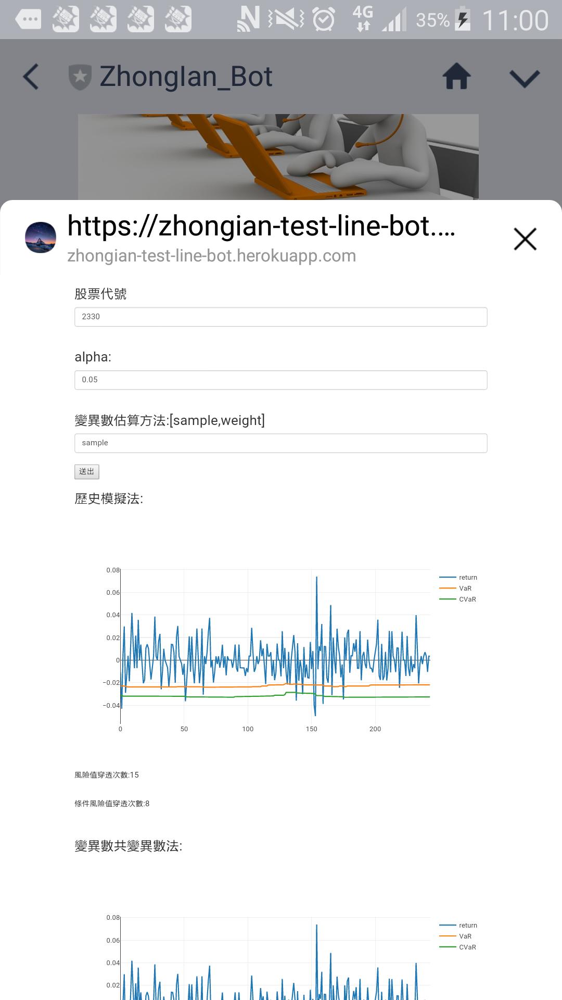

僅記錄參考資源及部分使用流程

# 功能函數

- [風險值](https://nbviewer.jupyter.org/github/ZhongIan/RE_Project/blob/master/%E9%A2%A8%E9%9A%AA%E5%80%BC/F_RE.ipynb)

- [股價資訊及相關新聞](https://nbviewer.jupyter.org/github/ZhongIan/py/blob/master/%E7%88%AC%E8%9F%B2/oil_and_stock_info.ipynb)

# 加入好友

- QRcode

# 功能介紹

## 油價資訊

## 股價資訊及股票相關新聞

## 功能列表

## 結合風險值以網頁形式在LINE上顯示

# line-bot on django

接收訊息後回傳訊息

- [網路來源](http://lee-w-blog.logdown.com/posts/1134898-line-echo-bot-on-django)

- [參考後操作紀錄](./Line-echobot.md)

# 各種line功能

- [push_tutorial](https://github.com/xiaosean/Line_chatbot_tutorial/blob/master/push_tutorial.ipynb)

# line-bot 參考:選單、分享好友、油價

- [line-bot-Tutorial](https://github.com/twtrubiks/line-bot-tutorial)

# line-bot LIFF

- [LINE 嵌入網頁](http://studyhost.blogspot.com/2018/06/linebot22-lifflinebotwebview.html)

# LINE 官網

- [官網](https://developers.line.biz/en/)

- [ZhongIan_Bot](https://developers.line.biz/console/channel/1623116169/basic/)

- [ZhongIan_Bot 選單](https://admin-official.line.me/14197696/richmenu/#/?rowCount=20&_=1552895085157)

# django to HEROKU

- [網路來源](http://lee-w-blog.logdown.com/posts/1148021-deploy-linebot-on-heroku)

- [參考後操作紀錄](./djaogo-heroku.md)

# HEROKU 官網

- [HEROKU getting-started-with-python](https://devcenter.heroku.com/articles/getting-started-with-python)

- [my app](https://dashboard.heroku.com/apps/zhongian-test-line-bot)

